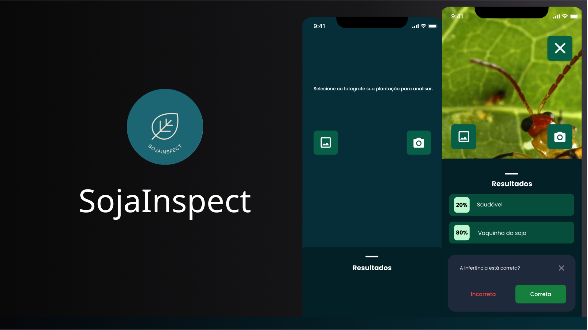

<h1 align="center">
  
</h1>

**Sumário**

- [Sobre o projeto](#sobre-o-projeto)
  - [Funcionalidades](#funcionalidades)
  - [Objetivo do projeto](#objetivo-do-projeto)
- [Tecnologias utilizada](#tecnologias-utilizada)
- [Prototipação do projeto](#prototipação-do-projeto)
- [Como executar o aplicativo em seu computador](#como-executar-o-aplicativo-em-seu-computador)
- [Instalar o aplicativo em seu celular](#instalar-o-aplicativo-em-seu-celular)


## Sobre o projeto

O aplicativo _mobile_ `SojaInspect`, foi desenvolvido como parte do Trabalho de Conclusão de Curso (TCC). O aplicativo tem como objetivo contribuir com a detecção de pragas em plantações de soja com uso de inteligência artificial (IA).

### Funcionalidades

- **Detecção de pragas**: quando o usuário envia uma imagem da soja pelo aplicativo, o SojaInspect se comunica através de uma API Rest que integra um modelo de IA treinado para identificar se há alguma praga na imagem fornecida. Para mais informações sobre a `API` acesse o repositório [API-SojaInspect](https://github.com/viniciusft81/tcc-detector-praga-api).
- **Visualização da inferência**: após enviar a imagem, é retornado a resposta da API, e no aplicativo é visualizado de forma amigável a inferência, o que permite ações no manejo da plantação.
- **Interface intuitiva**: a interface do aplicativo foi desenvolvida para ser de fácil uso e intuitiva, para que usuários com pouca familiaridade com tecnologia consigam utilizar o aplicativo sem dificuldades.

### Objetivo do projeto
O objetivo da criação do aplicativo `SojaInspect` é demonstrar a ideia de uma ferramenta acessível para o monitoramento de pragas. O aplicativo, se concentra em mostrar como as tecnologias de IA e mobile podem ser aplicadas no setor agrícola, incentivando a adoção de soluções tecnológicas no campo e contribuindo com a pesquisa acadêmica através da aplicação prática de modelos de IA. Este projeto é um exemplo de como a tecnologia pode resolver problemas reais na agricultura e o compromisso com a inovação e melhora contínua no setor agrícola.

## Tecnologias utilizada

- React Native
- Expo
- TailwindCSS
- Reanimated
- TypeScript

## Prototipação do projeto
- **Link do figma**: [SojaInspect](https://www.figma.com/design/pgXN3EkuG1my7AkS1eJgRT/SojaInspect-App?node-id=4008-64&t=7rlyOqGDTfytH1AK-1)

## Como executar o aplicativo em seu computador

1. Para obter o código fonte disponível neste repositório, execute o seguinte comando:

```ssh
cd ~
git clone https://github.com/viniciusft81/tcc-detector-praga-app.git
```
2. Instale as dependência do projeto:
```ssh
cd tcc-detector-praga-app
npm install
```

3. Por fim, utilizando o comando abaixo, inicie a aplicação:
```ssh
npx expo start
```
> Obs.: após iniciar, será disponibilizado um qr-code, dessa forma, escanei o qr-code no aplicativo `Expo Go`, disponível para `Android` e `iOS`.


## Instalar o aplicativo em seu celular

Para instalar o aplicativo `SojaInspect`, acesse o seguinte link: [SojaInspect.apk](). Em seguida, baixe e instale em seu celular.